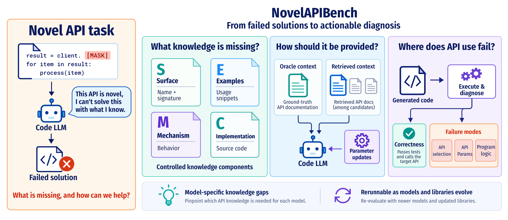
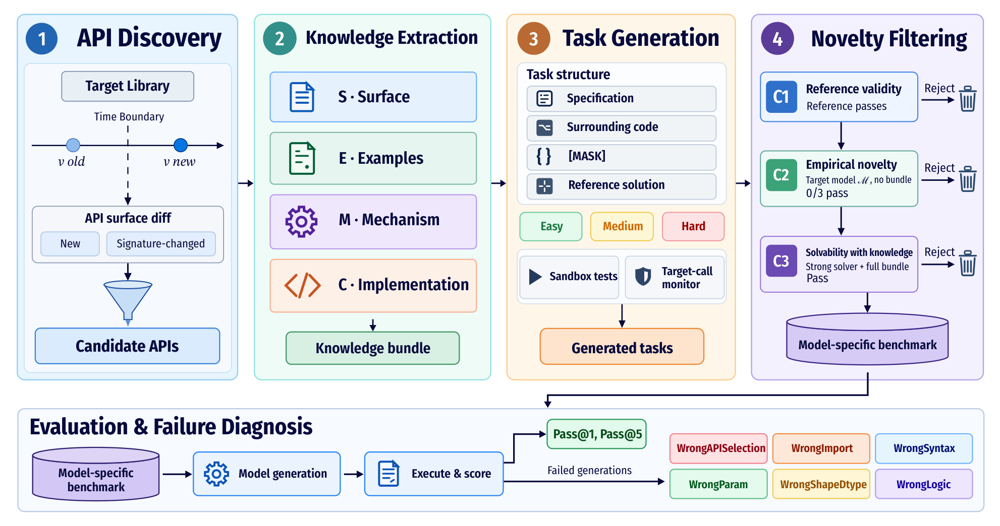

# NovelAPIBench

**NovelAPIBench** is a diagnostic framework and benchmark for how code LLMs learn to use
**novel APIs**: functions and classes that were introduced or whose signatures changed after a
model's training data was collected. It is the code and data release of the paper

> **NovelAPIBench: Diagnosing How A Code LLM Learns to Use Novel APIs**<br>
> Jinnuo Liu, Yue Peng, Jinhan Niu, Hongyi Wen<br>
> arXiv:2606.03657, 2026. [[Paper]](https://arxiv.org/abs/2606.03657)



A failed solution alone does not say what the model was missing. NovelAPIBench separates three
questions:

1. **What knowledge is missing?** Each task comes with a *knowledge bundle* for its target API,
   split into components that can be supplied separately: the surface **S** (name `S_name` and
   parameters `S_param`), usage **E**xamples, a description of the **M**echanism, and the
   implementation source **C**.
2. **How should it be provided?** The same knowledge can be put in the prompt directly (oracle),
   retrieved from the documentation of many APIs (RAG), or written into the weights (fine-tuning
   and knowledge editing).
3. **Where does API use fail?** Every completion is executed in the library's new version with a
   monitor on the target API, and every failure gets one of six labels (`WrongAPISelection`,
   `WrongImport`, `WrongSyntax`, `WrongParam`, `WrongShapeDtype`, `WrongLogic`).

**The benchmark is model-conditioned.** Whether an API is novel depends on the model, so each
backbone gets its own *instance*: the tasks it cannot solve without knowledge, but that are solvable
when the full bundle is given. The pipeline can be rerun as models and libraries evolve.

This repository contains:

- the **benchmark**: 2,600 candidate APIs from 21 Python libraries in five domains, 1,893
  knowledge bundles, 2,330 executable tasks, and the instances of six backbones (1,569 to 1,740
  tasks each);
- the **evaluation harness**: sandboxed execution, the target-call monitor and call-record check,
  and the failure classifier;
- the **experiments** of the paper: knowledge components (RQ1), retrieval (RQ2) and parametric
  adaptation (RQ3), plus the per-task verdicts behind every figure and table;
- the **construction pipeline** that rebuilds the benchmark for new models, libraries or release
  dates.

## Contents

- [Main findings](#main-findings)
- [Installation](#installation)
- [Quick start](#quick-start)
- [Evaluating your own model](#evaluating-your-own-model)
- [Reproducing the paper](#reproducing-the-paper)
- [Building a new benchmark](#building-a-new-benchmark)
- [Data](#data)
- [Repository layout](#repository-layout)
- [Notes on reproducibility](#notes-on-reproducibility)
- [Citation](#citation)
- [License](#license)

## Main findings

Pass@1 of Qwen2.5-Coder-7B-Instruct on its instance (1,670 tasks, 856 APIs), unless noted.

| Finding | Evidence |
|---|---|
| **Examples are the strongest single component.** | `E` alone: 67.2%, vs. 43.0% for `S`, 50.0% for `C` and 3.2% for `M`. `S+E` reaches 69.5% and `Full` 71.4%. |
| **Surface information matters when an existing API changes.** | Adding `S` to `E` gives +0.7 pp on newly introduced APIs but +10.2 pp on signature-modified APIs; the difference holds on all six backbones. |
| **The trends hold across backbones.** | On the 1,405 tasks shared by all six backbones, `E` beats `S` by 17.9 to 25.3 pp, and `Full` is within −1.5 to +1.8 pp of `S+E`. |
| **Retrieval costs accuracy, even when it finds the target.** | Retrieval lowers pass@1 by 17.4 to 23.9 pp (`Full`: 71.4% → 51.0%). On the 960 tasks where the target API is in the top five chunks, `Full` still loses 6.4 pp. |
| **Fine-tuning improves the use of supplied knowledge.** | On 348 held-out tasks with unseen APIs, SFT and RAFT raise pass@1 with the `Full` bundle from 71.3% to 82.8% and 85.3%, but stay at or below 2.3% without it. GRACE, MEMIT and AlphaEdit-LoRA do not significantly improve on the base model. |

`python scripts/analyze.py` recomputes all of these numbers from the released verdicts (see
[Reproducing the paper](#reproducing-the-paper)).

## Installation

Requirements: Linux x86-64 and Python 3.11. Inference and RQ3 training need NVIDIA GPUs with a
CUDA 12 driver; evaluation runs on CPUs.

```bash
git clone https://github.com/MAPS-research/NovelAPIBench.git
cd NovelAPIBench
conda create -n novelapibench python=3.11 -y
conda activate novelapibench
pip install -r requirements.txt   # exact versions used for the paper (vLLM 0.19, torch 2.10, ...)
pip install -e .
```

**Execution environments.** A task's generated code runs in a separate environment that has the
library's new version (`new_version` in `configs/libraries/`). Create them from the lockfiles in
`envs/locks/`. Each is a Python 3.11 venv under `envs/`, about 40 GB for all 17. pandas, scipy,
rdkit and httpx run in the main environment and need nothing here.

```bash
python scripts/setup_envs.py                                   # all libraries
python scripts/setup_envs.py --libraries numpy flask pydantic  # or only some
python scripts/setup_envs.py --for-instance qwen2.5-coder-7b --domains swe   # the libraries of one instance
python scripts/setup_envs.py --check                           # which environments are ready
```

**Models** are downloaded from the Hugging Face Hub at the revisions pinned in `configs/models/`.
Point the cache at a filesystem with enough space (`export HF_HOME=/path/to/cache`).

**OpenAI API key.** GPT-5-mini labels failures during evaluation and is used by benchmark
construction. Set `export OPENAI_API_KEY=...`. Pass@1 does not need it:
`scripts/evaluate.py --no-failure-labels` skips the labels.

**Output locations.** Outputs go to `outputs/`; set `NOVELAPIBENCH_OUTPUTS` to change this.
`NOVELAPIBENCH_ENVS` moves the execution environments.

## Quick start

### Browse the benchmark

```python
from novelapibench.benchmark import load_bundles, load_instance
from novelapibench.knowledge import parse_condition, render_knowledge
from novelapibench.prompts import build_prompt

tasks = load_instance("qwen2.5-coder-7b")        # 1,670 tasks; also: domains=[...], limit=N
task = tasks[0]
print(task.task_id, task.api_name, task.library, task.domain, task.difficulty)

bundle = load_bundles()[task.api_name]            # S_name, S_param, examples, mechanism, implementation
knowledge = render_knowledge(bundle, parse_condition("S+E"))
prompt = build_prompt(task, knowledge)            # build_prompt(task) for the no-knowledge prompt
```

The twelve knowledge conditions are named as in the paper:
`none, S_name, S, E, M, C, S+M, S+E, S+C, S+M+C, S+E+C, Full`
(`S = S_name + S_param`, `Full = S + E + M + C`).

### Trying it on a few tasks

Every script takes `--debug`: it runs on a few tasks and writes to `outputs/debug/`, so a check
of the setup never mixes with full runs. The whole sequence below takes about 40 minutes on one
80 GB GPU, mostly model loading.

```bash
python scripts/setup_envs.py --for-instance qwen2.5-coder-7b
python scripts/run_inference.py --experiment rq1 --conditions none S+E Full --debug   # 2 tasks per domain
python scripts/evaluate.py --run rq1-qwen2.5-coder-7b --debug
python scripts/run_inference.py --experiment rq2 --conditions S+E --debug
python scripts/evaluate.py --run rq2-qwen2.5-coder-7b --debug
python scripts/train_adaptation.py --method sft --debug                               # 8 examples, 1 epoch
python scripts/run_inference.py --experiment rq3 --methods base sft --debug
python scripts/evaluate.py --run rq3-qwen2.5-coder-7b --debug
python scripts/analyze.py --source runs --debug
```

## Evaluating your own model

NovelAPIBench is model-conditioned: an *instance* holds the tasks that are novel for one
backbone. To study your model under the paper's definition of novelty, first give it its own
instance, then run the experiments on it. Both steps work for any causal LM on the Hugging Face
Hub that vLLM can serve.

### 1. Add the model

Add `configs/models/<name>.yaml`, following the existing files:

```yaml
name: Qwen/Qwen2.5-Coder-7B-Instruct        # Hugging Face id
revision: c03e6d358207e414f1eca0bb1891e29f1db0e242
max_seq_len: 16384
max_new_tokens: 2048
thinking_mode: false                        # true for reasoning models (see r1-distill-qwen-7b.yaml)
trust_remote_code: false
tensor_parallel_size: 1
```

### 2. Build its instance

`scripts/build_instance.py` applies Stage 4 to your model on the released tasks, with the
settings of the paper:

1. **C2 (novelty):** your model completes each task three times without knowledge, at T = 0.8.
   A task is novel for it when all three completions fail.
2. **C3 (solvability):** GPT-5-mini must solve each novel task with the Full bundle, as for the
   released instances.
3. **Call-record check:** novel tasks that are in no released instance get reference call
   records and the second C3 pass (Appendix B.3).

```bash
python scripts/build_instance.py --model <name> --phase generate                    # C2 completions (GPU)
python scripts/build_instance.py --model <name> --phase score c3 call-records instance   # CPU + OpenAI API
python scripts/build_instance.py --model <name> --debug                             # everything, 2 tasks per library
```

The CPU phases run eight jobs in parallel by default. On a larger machine, raise this with
overrides, e.g. `construction.stage4.c2.workers=24 construction.stage4.c3.workers=24`
(`configs/construction.yaml`).

Running the command again skips the work already recorded. The instance is written to
`outputs/instances/<name>/instance.txt`, next to the records of each filter. From then on, every script takes `--model <name>` like a
released backbone.

For Qwen2.5-Coder-3B-Instruct, the full run took 2 minutes of generation on one H100, then about
2.5 hours on 32 CPU cores. That covered scoring the 6,987 completions, C3 on the 2,171 novel tasks
(up to three GPT-5-mini calls each), and the call-record check for the 15 novel tasks outside the
released records. The resulting instance has 1,685 tasks.

### 3. Run the experiments

```bash
python scripts/run_inference.py --experiment rq1 --model <name> --conditions cross-backbone   # the nine conditions of the cross-backbone study
python scripts/run_inference.py --experiment rq1 --model <name>                              # or all twelve
python scripts/run_inference.py --experiment rq2 --model <name>                              # retrieved knowledge
python scripts/evaluate.py --run rq1-<name>
python scripts/evaluate.py --run rq2-<name>
```

### Using your own inference code

The evaluator scores any file of responses, so the model can also be served in other ways (an
API, your own server, an agent). Write one record per task to
`outputs/runs/<run>/<cell>/predictions.jsonl`:

```json
{"task_id": "llm_a0ceaa490480", "samples": ["<the model's full response>"]}
```

`samples[0]` is the greedy response. The evaluator extracts the code from it, so the response may
contain prose and a fenced code block. A minimal loop:

```python
import json
from pathlib import Path
from novelapibench.benchmark import load_bundles, load_instance
from novelapibench.knowledge import parse_condition, render_knowledge
from novelapibench.prompts import build_prompt

condition = parse_condition("S+E")
bundles = load_bundles()
cell = Path("outputs/runs/my-model") / condition.value
cell.mkdir(parents=True, exist_ok=True)
with open(cell / "predictions.jsonl", "w") as f:
    for task in load_instance("<name>"):                  # or a released instance, e.g. "qwen2.5-coder-7b"
        prompt = build_prompt(task, render_knowledge(bundles[task.api_name], condition))
        response = my_model(prompt)                       # your model call
        f.write(json.dumps({"task_id": task.task_id, "samples": [response]}) + "\n")
```

Then score it. Results go to `<cell>/results.jsonl` (one record per task) and
`<cell>/summary.json`:

```bash
python scripts/evaluate.py --run my-model --no-failure-labels   # pass@1 only
python scripts/evaluate.py --run my-model                       # with failure labels (OPENAI_API_KEY)
```

If the model is not on the Hugging Face Hub, C2 can still be applied through the same file
format: sample three completions per task for the prompt of
`novelapibench.construction.stage4.c2.build_prompt(task)`, write them to
`outputs/instances/<name>/c2.completions.jsonl` (`{"task_id": ..., "completions": [c1, c2, c3]}`),
and run the phases after `generate`. On a
released instance instead of its own, your model may already know some of the APIs, so the
`none` condition is no longer near zero.

## Reproducing the paper

### Figures and tables from the released verdicts (no GPU)

```bash
python scripts/analyze.py            # -> outputs/analysis/paper/{tables,figures}
```

This regenerates Figures 3 to 6 and Table 1 from `data/paper_results/`, and prints every number
the main text quotes. These include pass@1 per knowledge condition, the novelty-type interaction
test, the retrieval gap, and the RQ3 comparisons with confidence intervals and Holm-adjusted
McNemar tests.

### RQ1: what knowledge enables effective API use? (Section 4.2, Figures 3 and 4)

```bash
# twelve knowledge conditions on the primary backbone (1,670 tasks)
python scripts/run_inference.py --experiment rq1 --model qwen2.5-coder-7b
python scripts/evaluate.py --run rq1-qwen2.5-coder-7b
# the nine conditions of the cross-backbone study, on each other backbone's own instance
for m in qwen2.5-coder-14b qwen2.5-coder-32b opencoder-8b-instruct seed-coder-8b-instruct r1-distill-qwen-7b; do
  python scripts/run_inference.py --experiment rq1 --model $m --conditions cross-backbone
  python scripts/evaluate.py --run rq1-$m
done
```

Pick any subset of conditions with `--conditions`. `--pass-at-5` adds the 20 samples at T = 0.8
used for pass@5 (Appendix).

### RQ2: retrieved instead of oracle knowledge (Section 4.3, Figure 5)

```bash
python scripts/run_inference.py --experiment rq2 --model qwen2.5-coder-7b
python scripts/evaluate.py --run rq2-qwen2.5-coder-7b
```

Each domain gets one FAISS index per condition, over the bundles of all its libraries' APIs
(including APIs without tasks):

- Bundles are split into 512-word chunks with a 64-word overlap, rejoined with single spaces.
- Chunks are embedded with BGE-small, whose encoder truncates chunks and queries to 512 tokens.
  The query carries no retrieval instruction.
- The top five chunks, untruncated, replace the bundle in the prompt (Appendix D.3).

### RQ3: parametric adaptation (Section 4.4, Table 1, Figure 6)

Training uses the 1,502 tasks of `data/benchmark/splits/rq3_train.txt`. Evaluation uses the 348
test tasks that remain in the final instance. Hyperparameters are in `configs/adaptation.yaml`.
Everything runs on one 80 GB GPU.

```bash
python scripts/train_adaptation.py --method sft
python scripts/train_adaptation.py --method raft
python scripts/train_adaptation.py --method grace
python scripts/train_adaptation.py --covariance          # layer 5-9 statistics (Wikitext-103) + AlphaEdit projector
python scripts/train_adaptation.py --method memit        # optional: --shard i --num-shards n first, in parallel
python scripts/train_adaptation.py --method alphaedit_lora
python scripts/run_inference.py --experiment rq3         # base, sft, raft, grace, memit, alphaedit_lora x {none, Full}
python scripts/evaluate.py --run rq3-qwen2.5-coder-7b
```

### Figures and tables from your own runs

```bash
python scripts/analyze.py --source runs --retrieval-hits   # reads outputs/runs/*/<cell>/results.jsonl
```

### Evaluation and failure diagnosis (Sections 3.3 and 4.1)

`scripts/evaluate.py` does the following for each response:

1. Extracts the code (Appendix D.1).
2. Runs it in the task's program context and the library's environment.
3. Records pass/fail and a failure label.

A completion passes when all three hold:

- it runs without error;
- it calls the target API;
- it reproduces the reference solution's calls to that API (the call-record check, Appendix B.3).

Failures are labeled in two steps. Syntax errors and unresolved target symbols are labeled
deterministically. The rest are labeled by GPT-5-mini from the task, the code, the extracted
calls and the traceback (Appendix C).

## Building a new benchmark



`scripts/build_benchmark.py` runs the pipeline stage by stage under `outputs/construction/`. It
never modifies the released `data/`. To add a backbone to the released benchmark, only Stage 4 is
needed ([Evaluating your own model](#evaluating-your-own-model)).

```bash
python scripts/build_benchmark.py pool --libraries flask                 # Stage 1: environments, API diff, candidate pool
python scripts/build_benchmark.py extract --libraries flask --from-pool   # Stage 2: knowledge bundles (GPT-5-mini + web search)
python scripts/build_benchmark.py generate --libraries flask              # Stage 3: tasks and test harnesses
python scripts/build_benchmark.py filter c1 --libraries flask             # Stage 4, C1: reference validity
python scripts/build_benchmark.py filter c2 --model qwen2.5-coder-7b --libraries flask   # C2: novelty for one backbone (GPU)
python scripts/build_benchmark.py filter c3 --libraries flask             # C3: solvable with the Full bundle
python scripts/build_benchmark.py call-records --libraries flask          # reference call records
python scripts/build_benchmark.py c3-recheck --libraries flask            # C3 under the call-record check -> exclusions
python scripts/build_benchmark.py instances                               # per-backbone instances and the RQ3 split
```

- **Stage 1: API discovery.** For each library, installs the last release before the boundary
  (`v_old`) and a newer one (`v_new`), diffs their public API surfaces, and keeps new and
  signature-changed APIs.
- **Stage 2: knowledge extraction.** Builds each API's bundle (`S`, `E`, `M`, `C`) from the
  installed source, docstrings, changelogs and web search. Examples are executed.
- **Stage 3: task generation.** Writes tasks at three difficulty levels. Each task has a
  specification, surrounding code, a masked region, a reference solution, and an
  execute-then-assert test harness.
- **Stage 4: filtering.** C1 keeps tasks whose reference passes. C2 keeps the tasks a given
  backbone fails in all three attempts without knowledge. C3 keeps the tasks a strong solver can
  solve with the Full bundle.

**Configuring a rebuild.**

- *New backbone:* add it to `construction.instances.models` in `configs/construction.yaml`.
- *New library:* add `configs/libraries/<name>.yaml`.
- *Later release boundary:* change it in `configs/construction.yaml`.
- *Quick runs:* `--max-apis N` and `--limit N` restrict a stage.

LLM outputs are sampled, so a rebuild yields new tasks for the same APIs. The released
`data/benchmark/` is the frozen benchmark used in the paper.

## Data

### Benchmark statistics

| Domain | Libraries (old → new version) | Tasks in the primary instance |
|---|---|---:|
| AI for science | MDAnalysis, ase, astropy, deepchem, pymatgen, rdkit, scanpy | 390 |
| Deep learning | diffusers, torch, transformers | 700 |
| Agent tools | fastmcp, langgraph (new libraries) | 268 |
| Data science | numpy, pandas, scipy | 238 |
| Software engineering | django, fastapi, flask, httpx, pydantic, sqlalchemy | 74 |

Exact versions are in `data/benchmark/manifest.json` and `configs/libraries/`. The release
boundary is 2023-12-01.

| Instance | Tasks |
|---|---:|
| `qwen2.5-coder-7b` (primary) | 1,670 |
| `qwen2.5-coder-14b` | 1,628 |
| `qwen2.5-coder-32b` | 1,569 |
| `opencoder-8b-instruct` | 1,691 |
| `seed-coder-8b-instruct` | 1,661 |
| `r1-distill-qwen-7b` | 1,740 |

### Files

| File | Content |
|---|---|
| `data/benchmark/bundles.jsonl` | knowledge bundles: `s_name` (S_name), `s_param` (S_param), `examples` (E), `mechanism` (M), `implementation` (C), and the novelty type `is_modified` |
| `data/benchmark/tasks.jsonl` | tasks: `description`, `context_code`, `masked_region` (the reference completion), `reference_solution`, `test_harness`, `difficulty` |
| `data/benchmark/instances/<backbone>.txt` | task ids of each backbone's instance |
| `data/benchmark/splits/rq3_{train,test}.txt` | RQ3 split by target API (1,502 / 397 tasks; 348 test tasks remain in the final instance) |
| `data/benchmark/excluded_tasks.tsv` | tasks removed from every instance, with the reason |
| `data/benchmark/expected_calls.jsonl` | reference call records used by the call-record check |
| `data/benchmark/filters/c1.jsonl` | C1 verdict of every task |
| `data/benchmark/filters/c2/<backbone>.jsonl` | C2 verdict per task and backbone: which of the three samples failed, and whether the task is novel |
| `data/benchmark/filters/c2/<backbone>.completions.jsonl.gz` | the three sampled completions behind each C2 verdict |
| `data/benchmark/filters/c3/<backbone>.jsonl` | C3 verdict of each of the backbone's novel tasks |
| `data/benchmark/filters/c3_recheck.jsonl.gz` | the second C3 pass under the call-record check, with its samples |
| `data/benchmark/manifest.json` | counts, library versions, checksums |
| `data/pool/` | the 2,600 Stage-1 candidates, their membership per release boundary, and the pool manifest |
| `data/paper_results/` | per-task verdicts (and RQ3 responses) behind the paper's figures and tables; columns are documented in its `manifest.json` |
| `data/adaptation/memit_context_templates.json` | MEMIT context templates used in the paper |

The filter records reproduce every released instance, the exclusion list and the RQ3 split:

```bash
python scripts/build_instance.py --verify
```

C3 was run for each backbone on its own novel tasks, so a task can have different C3 verdicts for
different backbones. The 32B backbone has no torch records: its 71 torch tasks were excluded
before C2 because their distributed-execution workloads exceeded the cluster's memory limit
(Appendix B).

Pydantic schemas of all records are in `novelapibench/schemas.py`. Licenses of the quoted library
code are listed in `data/LICENSES.md`.

## Repository layout

| Path | Purpose |
|---|---|
| `configs/` | `default.yaml` (decoding, evaluation, retrieval), `construction.yaml`, `adaptation.yaml`, `models/<backbone>.yaml`, `libraries/<library>.yaml` |
| `data/` | the released benchmark, candidate pool and paper verdicts (see [Data](#data)) |
| `envs/locks/` | exact package sets of the per-library execution environments |
| `novelapibench/` | the Python package (see the code map below) |
| `scripts/` | command-line entry points: `setup_envs.py`, `run_inference.py`, `evaluate.py`, `train_adaptation.py`, `analyze.py`, `build_instance.py`, `build_benchmark.py` |
| `third_party/memit/` | upstream MEMIT (MIT license), with the changes listed in its `NOTICE` |

**Code map.**

| Paper | Code (`novelapibench/`) |
|---|---|
| Knowledge bundle, conditions, prompt (Sec. 3.1, App. D.2) | `schemas.py`, `knowledge.py`, `prompts.py` |
| Construction Stages 1 to 4 (Sec. 3.2, App. B.2) | `construction/stage1..4/`, `construction/call_records.py`, `construction/instances.py` |
| Harness, call-record check (App. B.3) | `evaluation/harness.py`, `evaluation/call_check.py`, `runtime/sandbox.py`, `runtime/envs.py` |
| Code extraction (App. D.1) | `evaluation/extraction.py` |
| Failure diagnosis (Sec. 3.3, App. C) | `evaluation/failure_taxonomy.py` |
| Inference, retrieval (Sec. 4, App. D.1, D.3) | `llm/local.py`, `inference/runner.py`, `inference/retrieval.py` |
| Adaptation methods (Sec. 4.4, App. D.4) | `adaptation/` |
| Statistics (App. D.5), figures and tables | `analysis/` |

Generated predictions, results, environments and caches are written to `outputs/` and `envs/`.
Both are gitignored.

## Notes on reproducibility

- **vLLM outputs vary slightly across hardware.** Decoding is greedy, but outputs are not
  bit-identical across GPU types and batch compositions. Re-generated completions differ from the
  paper's on a small fraction of tasks. `data/paper_results/` holds the exact verdicts behind the
  reported numbers.
- **Failure labels can vary between calls.** They come from GPT-5-mini. Pass@1 does not depend on
  them.
- **Avoid spurious timeouts.** Execution is subject to per-library time limits
  (`eval_timeout_seconds`). Run evaluation with at most one worker per CPU core (`--workers`), so
  that slow imports do not turn into timeouts.
- **MEMIT context templates are fixed.** The upstream code samples them once. The file used for
  the paper, `data/adaptation/memit_context_templates.json`, is used by default.
- **Construction is not deterministic.** It calls a live web-search API, fetches changelog pages,
  and samples its LLM calls. The LLM cache of the original build is not distributed.

## Citation

If you use NovelAPIBench, please cite:

```bibtex
@misc{liu2026novelapibench,
  title  = {NovelAPIBench: Diagnosing How A Code LLM Learns to Use Novel APIs},
  author = {Liu, Jinnuo and Peng, Yue and Niu, Jinhan and Wen, Hongyi},
  year   = {2026},
  eprint = {2606.03657},
  archivePrefix = {arXiv},
  primaryClass  = {cs.AI},
  url    = {https://arxiv.org/abs/2606.03657}
}
```

## License

- **Code and our benchmark materials:** Apache-2.0 (`LICENSE`).
- **Content quoted from the 21 libraries** (implementation source, signatures, docstrings,
  documentation excerpts) keeps its upstream license. `data/LICENSES.md` records which fields
  quote what. `data/licenses/<library>/` holds each library's license text and copyright notices
  at the release used.
- **`third_party/memit/`:** MIT.
